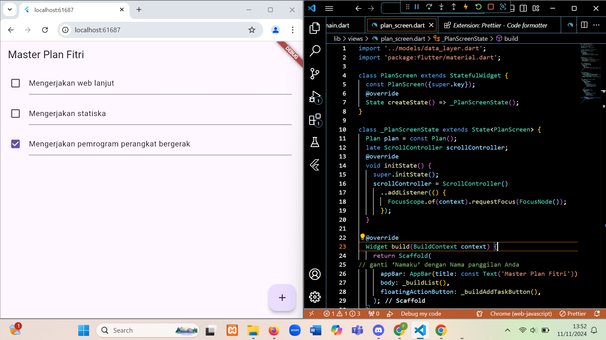

Nama: Fitria Ayu Pratiwi
NIM: 362358302016

Praktikum 1

1. 

2. Jelaskan maksud dari langkah 4 pada praktikum tersebut! Mengapa dilakukan demikian?
   Menjaga keteraturan kode, menghemat waktu, dan mengurangi kemungkinan error saat mengelola proyek yang semakin besar.

3. Mengapa perlu variabel plan di langkah 6 pada praktikum tersebut? Mengapa dibuat konstanta ?
   variabel plan digunakan untuk menyimpan instance dari kelas Plan, yang kemungkinan merupakan model data yang mewakili rencana atau daftar tugas yang akan ditampilkan di layar PlanScreen.

4. Apa kegunaan method pada Langkah 11 dan 13 dalam lifecyle state ?
   Digunakan untuk menginisialisasi dan membersihkan resource, terutama untuk objek yang memerlukan manajemen khusus seperti ScrollController
